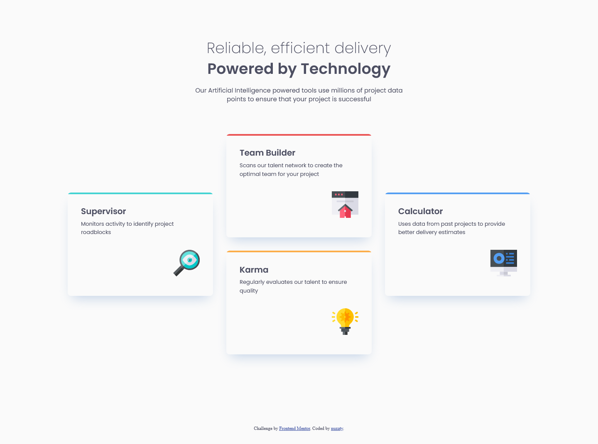
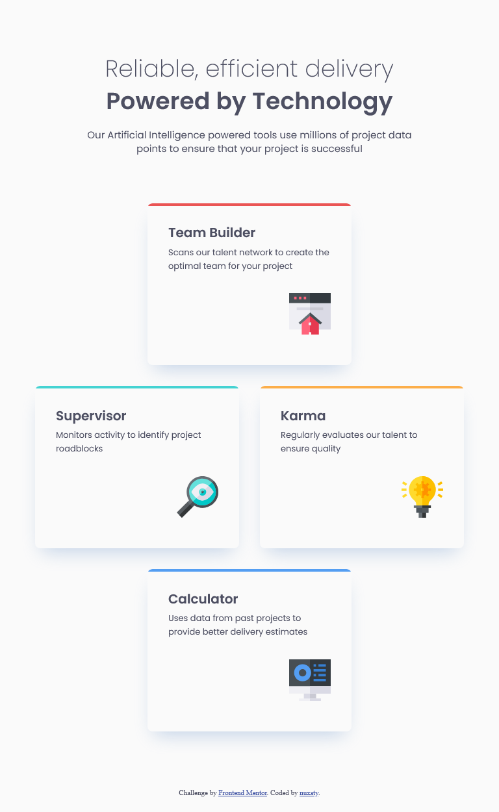
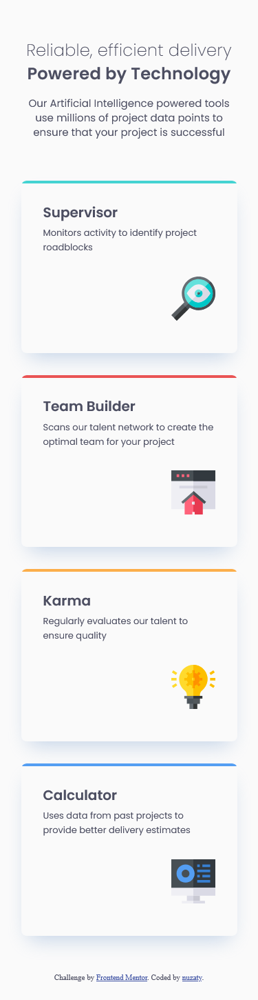

# Frontend Mentor - Four card feature section solution

This is a solution to the [Four card feature section challenge on Frontend Mentor](https://www.frontendmentor.io/challenges/four-card-feature-section-weK1eFYK). Frontend Mentor challenges help you improve your coding skills by building realistic projects.

### Screenshot

Desktop
[](./screenshot/screen-desktop.png)

<table style="border: none;">
<tr style="border: none;">
<td style="border: none;">

Tablet
[](./screenshot/tablet-tablet.png)

</td>
<td style="border: none;">

Mobile
[](./screenshot/tablet-mobile.png)

</td>
</tr>
</table>

### Links

- Solution URL: [https://www.frontendmentor.io/solutions/four-card-feature-section-using-sass-8ibr03hEvt](https://www.frontendmentor.io/solutions/four-card-feature-section-using-sass-8ibr03hEvt)
- Live Site URL: [https://nuzaty.github.io/fm-06-four-card/](https://nuzaty.github.io/fm-06-four-card/)

### Built with

- Semantic HTML5 markup
- Flexbox
- CSS Grid
- Mobile-first workflow
- Sass (Dart Sass)
- BEM

### CSS build

Install globally (one-time):

```
npm install -g sass
```

Dev:

```
sass --watch scss:dist
```

Build:

```
sass scss:dist
```
